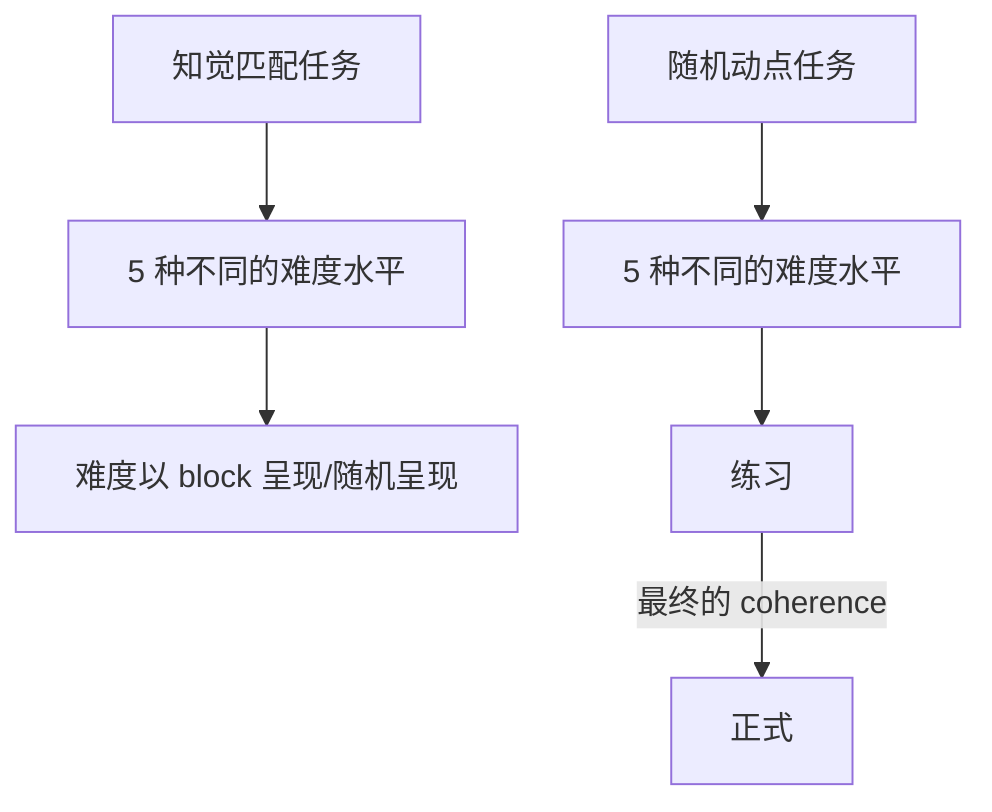

## 实验设计
2×5×2混合设计
- 刺激类型：自我相关、他人相关 （组内变量）
- 知觉难度：4 种水平 （组内变量）
- 知觉维度：运动方向、颜色 （组间变量）
### 流程图

在现在的匹配任务中，被试需要先识别出点的一致运动方向或整体颜色，再与人物标签进行匹配
- 最后期望的结果是 4 种难度水平的正确率不存在显著差异

## 数据分析

- 知觉匹配任务
  - 难度以 block 的形式呈现
    - 比较单个 block 内前一半后后一半的变化趋势（或者是前中后的差异）
    - 比较不同难度下的正确率
  - 难度随机呈现
    - 比较不同难度下的正确率
  - 比较两种不同（难度）呈现方式的差异
  - 难度的主效应
  - 人物标签的主效应
  - 匹配类型的主效应
  - 三者的交互作用
- 随机动点任务
  - 难度的主效应
  - 关联类型的主效应
  - 难度与关联类型的交互作用
  - 不同呈现方式的比较
