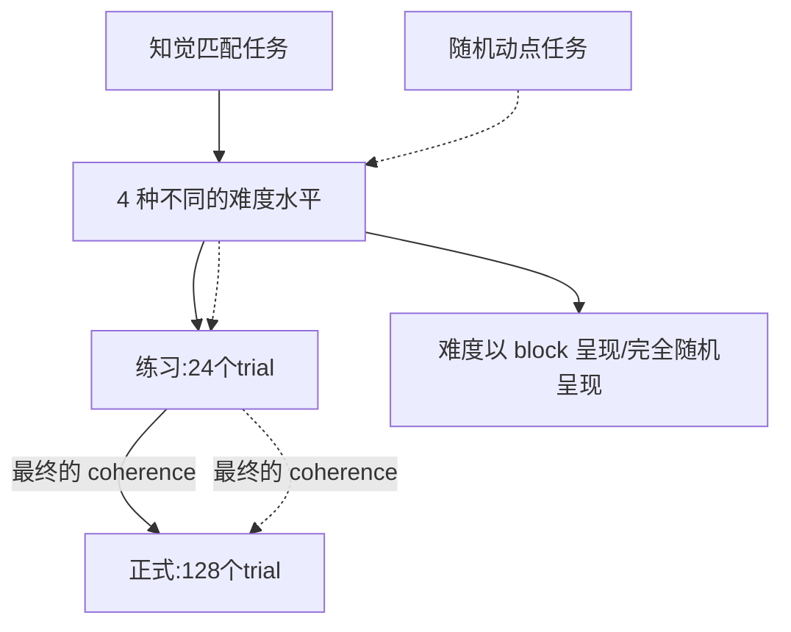

## 实验设计
2×4×2混合设计
- 刺激类型：自我相关、他人相关 （组内变量）
- 知觉难度：4 种水平 （组内变量）
- 知觉维度：运动方向、颜色 （组间变量）

### 任务思路

在现在的匹配任务中，被试需要先识别出点的一致运动方向或整体颜色，再与人物标签进行匹配

### 难度呈现方式

1. 完全随机：所有难度的 trial 完全混合，随机呈现
   - 优点：
     - 避免预期效应
     - 避免被试的策略性调整，例如在某些困难 block 下注意力更集中
   - 缺点：
     - 试次间的变异性较大，可能需要更多 trial 来平衡随机波动（增加被试疲劳）
2. 分块呈现：block 内难度相同，block 间难度变化
   - 优点：不同难度的表现较为稳定，有利于分析难度的影响
   - 缺点：
     - 可能会存在明显的难度适应
     - 需要平衡顺序效应
3. 混合呈现：每个 block 包含两种难度（如难度1-2或3-4），形成相对低难度 block 和高难度 block。block 内不同难度随机呈现
   - 优点：
     - 表现相对稳定
     - 减少被试的部分预期和适应
   - 缺点：？
- 结合我们的**实验目的**，我们希望通过知觉匹配任务让被试将刺激（维度）与自我/他人形成普遍的关联，即**无论任务难度如何变化**（有多少点向左或向右运动/整体为红色还是蓝色），**自我/他人的关联效应都应该存在**。
  - 当前的 trial 数量为 128，每种难度下有 32 个 trial；
  - 综合来看，完全随机可能是最佳选择，因为它最大限度地减少了预期和策略调整，使得关联效应在不同难度下自然体现；
  - 其次是混合呈现，因为它减少了试次间变异，同时每个 block 内的两种难度随机呈现可以部分防止适应
  
## 数据分析

- 知觉匹配任务
  - 刺激类型主效应（自我相关 vs. 他人相关）
  - 匹配类型的主效应 （匹配 vs. 不匹配）
  - **关联效应检验**
    - 刺激类型 × 难度的交互作用，若不显著，则说明关联效应在不同难度下稳定存在
    - 将难度呈现方式（完全随机 vs. 混合）作为协变量，分析其对关联效应的影响 (如果加入混合/分块设计)
- 随机动点任务
  - 刺激类型主效应：自我相关是否提升任务表现
  - 刺激类型 × 难度的交互：检验自我相关对任务表现的影响是否受难度调节
