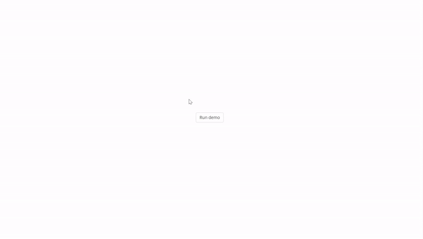

# jsPsych-rdk 插件修订版介绍

今天我将给大家介绍一个我们自己修改的 jsPsych 插件，它主要用于呈现随机动点刺激，并可以同时设定运动和颜色变化。文章的最后会介绍另一个简单但实用的插件（也是修改了的哦），感兴趣的小伙伴请不要错过。

## 随机点运动任务

在介绍这款插件之前，先给大家介绍一下什么是随机点运动任务 (random-dot kinematograms)
- 随机点运动任务是一个经典的**认知任务**，是研究感知决策 (perceptual decision making) 的标准范式。  
- 被试任务：  
   - 被试观察屏幕上的点，这些点以不同的一致性水平随机移动。  
   - 任务是判断这些点的主要移动方向（例如，向左还是向右）。


经典的随机点运动任务要求被试判断散点图的整体运动方向，在 jsPsych 中，我们可以使用 `jspsych-rdk` 插件来实现。这个插件不仅提供了丰富的参数设置，还支持多种运动类型和噪声类型。

然而，如果我们的任务不是要求被试判断运动方向，而是判断散点图的整体颜色呢？例如颜色识别任务。这就需要点以两种不同的颜色显示，并可以改变颜色的比例以允许不同的任务难度。原版插件无法实现这一功能，需要自己修改插件的源码，或是将不同的光圈 (aperture) 叠加来达到这一效果。

并且在原版插件中，信号和噪声从一开始就按指定类型运动，如果我们希望设置一个延迟时间呢？即刺激出现一段时间后，一定比例的点才开始向左或向右运动。这也需要我们自己去改源代码。

因此，为了实现上述功能并方便大家使用，我们在原插件的基础上增加了几个参数，实现了运动和颜色的双维变化，这样就不用每次都进行修改啦。接下来，让我们一起来看看修改后的新增功能及其效果吧！

## 新增功能

1. **运动延迟功能：** `motion_change_delay` 参数，以帧为单位设置运动延迟时间点。在此之前，所有点按指定噪声类型运动；之后，信号点沿指定方向移动，噪声点继续随机运动。参数的默认值为：0 。
2. **丰富的颜色设置：**
   - `dot_color` 参数可定义点的颜色，支持单颜色（输入字符串）或两种颜色（输入数组）设置。当输入数组时，默认的两种颜色比例为 5: 5。参数的默认值为： "white" 。
   - `color_change_delay` 参数以帧为单位设置颜色变化的延迟时间。在此之前，点的颜色采用 dot_color 的设定，在此之后，采用 dot_color_final 的设定。参数的默认值为：0 。
   - `dot_color_final` 参数可指定颜色延迟时间后的点的颜色。对于两种颜色的设置，数组中的第一个元素为目标点颜色，第二个为干扰点颜色。参数的默认值为： "white" 。
   - `target_color_proportion` 参数用于设定目标点颜色的比例，进一步细化颜色相关的实验条件。参数的默认值为：0 。

注：如果不需要颜色变化，直接在 dot_color 里输入相应颜色就可以，后面三个参数不变。


## 效果展示

运动延迟



示例中，我们设置了两个光圈，运动延迟的时间点分别为 0 帧（即无延迟）和 200 帧（按照 60 HZ 的刷新率，约等于 3.33 秒）。右边的光圈展示了一致运动的延迟。在延迟时间点前，所有点都随机运动方向；在该时间点后，信号点按指定方向运动，噪声点仍随机方向运动。

具体代码如下：

```js
var RDK_trial = {
  type: jsPsychRdk,
  number_of_dots: 100, 
  RDK_type: 3,
  choices: " ",
  trial_duration: 5000,
  coherence: 0.8,
  background_color: "grey",
  number_of_apertures: 2,
  motion_change_delay: [0, 200], 
  aperture_width: 400, 
  aperture_center_x: [(window.innerWidth/2)-250, window.innerWidth/2+250] 
}
```

设置不同颜色及比例，颜色变化延迟时间


在这个示例中，我们同样设置了两个光圈，并将颜色变化延迟时间设为 100 帧（约等于 1.67 秒），在这个时间后，左边光圈点的颜色仍然为白色，右边光圈中 80% 的点变为蓝色，其余点变为红色。

具体代码如下：

```js
var RDK_trial = {
  type: jsPsychRdk,
  number_of_dots: 100, 
  RDK_type: 3,
  choices: " ",
  trial_duration: 5000,
  background_color: "grey",
  dot_color_final:[["white", "white"], ["blue", "red"]], 
  target_color_proportion: 0.8, 
  color_change_delay: 100, 
  number_of_apertures: 2,
  aperture_width: 400, 
  aperture_center_x: [(window.innerWidth/2)-250, window.innerWidth/2+250] 
}
```


**末尾惊喜**

用过 jsPsych 的小伙伴应该对 `html-button-response` 和 `html-keyboard-response` 插件并不陌生。这两个插件分别用于收集鼠标点击和键盘按键的响应。

然而，在某些情况下，我们可能需要同时收集鼠标点击和键盘按键的响应，我们修改的另一个插件 `html-keynbutton-response` 能够满足这一需求，这样，你只需要一个插件就能实现两个功能啦！

希望这两个修改后的插件能够对你有所帮助，如果你觉得它们还有哪里可以改进，或者有任何其他的想法和建议，欢迎在评论区留言，我们一起把它们变得更好！

更多相关信息，请点击下方链接查看 :

1. <https://www.npmjs.com/package/@panwanke/plugin-rdk>
   
2. https://www.npmjs.com/package/@panwanke/jspsych-html-keynbutton-response