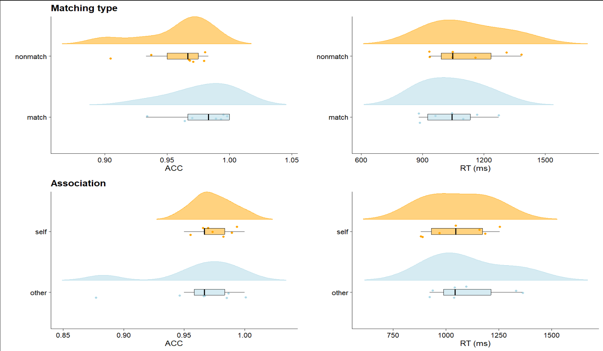

# 实验数据（10月）分析及结果
---
# 目录
- [**分析思路**](#分析思路)
- [**正确率和反应时的方差分析结果**](#正确率和反应时的方差分析结果)
  - [**运动组**](#运动组)
    - [匹配任务](#1.匹配任务)
    - [随机动点任务](#2.随机动点任务)
  - [**颜色组**](#颜色组)
    - [匹配任务](#1.匹配任务)
    - [随机点运动任务](#2.随机动点任务)
- [**SDT结果**](#SDT结果)
  - [**匹配任务**](#匹配任务)
  - [**随机动点任务**](#随机动点任务)

---

# 分析思路

1. **分 motion 和 color**
2. **对不同任务下的反应时进行重复测量方差分析**
  - 匹配任务
     - 关联类型主效应：自我 vs. 他人
     - 主效应：匹配 vs. 不匹配
     - 交互作用
  - rdk 判断任务
     - 主效应：自我 vs. 他人
     - 主效应：容易 vs. 困难
     - 交互作用
---
2. 正确率采用信号检测论的方法计算 d' 和 c
  - 匹配任务
    - 关联类型（自我/他人）
    - 匹配类型（匹配/不匹配）
    - 对比运动和颜色的差异
  - rdk 任务
    - 难度（容易/困难）
    - 关联类型（自我/他人）
    - 对比运动和颜色的差异
--- 
# 正确率和反应时的方差分析结果

---
## 运动组
### 运动组被试在不同任务中的平均正确率和反应时

  

---
## 运动组
### 1.匹配任务 

- **正确率 (ACC):**
  - 匹配类型的主效应不显著，
  *F* (1,6) = 5.17, *p* = 0.06, *η*²p = 0.46

  - 关联类型的主效应不显著，
  *F* (1,6) = 1.00, *p* = 0.36, *η*²p = 0.14

  - 二者的交互作用不显著，
  *F* (1,6) = 2.27, *p* = 0.18, *η*²p = 0.27

---
## 运动组
### 1.匹配任务 

- **反应时 (RT):**

  - 匹配类型的主效应显著，匹配条件下的反应时显著快于不匹配条件，
  *F* (1,6) = 7.67, *p* = 0.03, *η*²p = 0.56

  - 关联类型的主效应不显著，
  *F* (1,6) = 3.05, *p* = 0.13, *η*²p = 0.34

  - 二者的交互作用不显著，
  *F* (1,6) = 3.45, *p* = 0.11, *η*²p = 0.37

  

---
## 运动组
### 2.随机动点任务

- **正确率 (ACC):**
  - 难度的主效应显著，困难条件的正确率显著低于容易条件，
  *F* (1,6) = 42.77, *p* < 0.001, *η*²p = 0.877

  - 关联类型的主效应不显著，
  *F* (1,6) = 0.002, *p* = 0.97, *η*²p = 0.00

  - 二者的交互作用不显著，
  *F* (1,6) = 0.01, *p* = 0.92, *η*²p = 0.002

 

---
## 运动组
### 2.随机点运动任务

- **反应时 (RT)：**

  - 难度的主效应不显著，
  *F* (1,6) = 1.25，*p* = 0.31，*η*²p = 0.17

  - 关联类型的主效应不显著，
  *F* (1,6) = 0.38，*p* = 0.56，*η*²p = 0.06

  - 二者的交互作用不显著，
  *F* (1,6) = 0.52，*p* = 0.50，*η*²p = 0.08

 

---
## 颜色组
### 颜色组被试在不同任务中的平均正确率和反应时

---

## 颜色组
### 1.匹配任务 ( *n* = 15 )

- **正确率 (ACC):** 

  - 匹配类型的主效应不显著，
  *F* (1,14) = 0.72, *p* = 0.41, *η*²p = 0.49

  - 关联类型的主效应显著，自我条件下的正确率显著高于他人条件，
  *F* (1,14) = 22.28, *p* < 0.001, *η*²p = 0.61

  - 二者的交互作用不显著，
  *F* (1,14) = 0.03, *p* = 0.87, *η*²p = 0.002

---

## 颜色组
### 1.匹配任务 ( *n* = 15 )

- **反应时 (RT):**

  - 匹配类型的主效应显著, 匹配条件下的反应时显著低于不匹配条件，
  *F* (1,14) = 16.21, *p* = 0.001, *η*²p = 0.54

  - 关联类型的主效应显著，自我条件下的正确率显著高于他人条件，
  *F* (1,14) = 69.96, *p* < 0.001, *η*²p = 0.83

  - 二者的交互作用不显著，
  *F* (1,14) = 4.46, *p* = 0.53, *η*²p = 0.24

---

## 颜色组
### 2.随机动点任务 ( *n* = 8 )

- **正确率 (ACC):**

  - 难度的主效应不显著，
  *F* (1,14) = 2.27, *p* = 0.18, *η*²p = 0.25

  - 关联类型的主效应不显著，
  *F* (1,14) = 3.30, *p* = 0.11, *η*²p = 0.32

  - 二者的交互作用不显著，
  *F* (1,14) = 0.05, *p* = 0.84, *η*²p = 0.006

---

## 颜色组
### 2. 随机动点任务 ( *n* = 8 )

- **反应时 (RT):**

  - 难度的主效应不显著，
  *F* (1,14) = 3.32, *p* = 0.11, *η*²p = 0.32

  - 关联类型的主效应不显著，
  *F* (1,14) = 2.13, *p* = 0.19, *η*²p = 0.41

  - 二者的交互作用不显著，
  *F* (1,14) = 0.03, *p* = 0.87, *η*²p = 0.00

---
# SDT结果

---
## 匹配任务
### 运动组 (d')

  - 匹配类型的差异不显著，
  *F* (1,6) = 1.57, *p* = 0.26, *η*²p = 0.21

---
## 匹配任务
### 颜色组 (d')

  - 匹配类型的差异显著，自我条件 (3.91 ± 0.49) 下的 d' 显著高于他人条件 (3.21 ± 0.70)
  *F* (1,14) = 26.76, *p* < 0.001, *η*²p = 0.66

---
## 匹配任务 
### 运动 vs. 颜色 (d', *n* = 22)
由于两组的样本量不一致，这里就不报告统计结果了

---
## 随机动点任务 
### 运动组 (d', *n* = 7)

难度的差异显著，困难条件 (1.02 ± 0.63) 下的 d' 显著低于容易条件 (2.01 ± 0.58)
*F* (1,6) = 29.72, *p* = 0.002, *η*²p = 0.83

---
## 随机动点任务 
### 颜色组 (d', *n* = 8)

难度的差异不显著
*F* (1,6) = 2.44, *p* = 0.16, *η*²p = 0.26

  