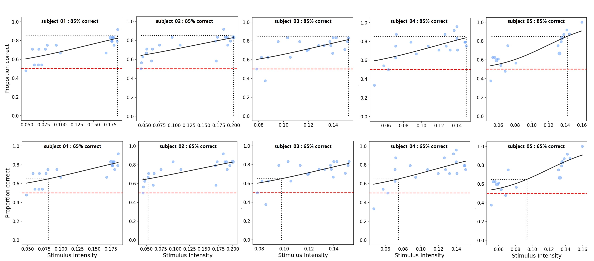
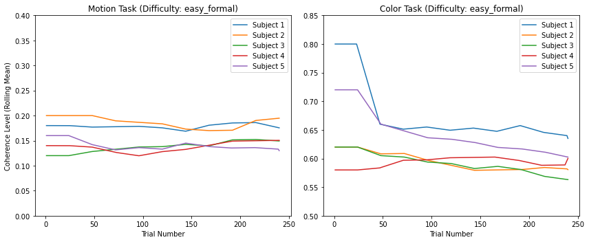

<!-- _class: fixedtitleA  tinytext-->

## 分析与结果

实验类型：2（判断类型：运动方向/颜色）×2（知觉难度：容易/困难） 被试内设计
- 分析数据只选取了正式测试阶段，每个条件进行10组测试，1组24个试次 
  
**分析思路**

- 拟合心理测量函数，得到正确率为 85% 和 65% 对应的相干性比例
  - 个体水平
  - 群体水平
  - 不同颜色的比较
- 检测自适应程序是否有效，即结果是否收敛。
  - 绘制相干性比例变化曲线，观察相干性比例在实验过程中的变化趋势

**工具**
- Python：`bayesfit` 包
---

**1. 查看数据分布**

---
<!-- _class: fixedtitleA navbar rows-2 -->
**2. 心理测量曲线**
**个体水平分析：**

运动

颜色

---
<!-- _class: fixedtitleA navbar cols-2 -->

**群体水平分析：**

不同正确率下对应的相干性比例

| ACC (%) | motion coherence | color coherence |
| --- | --- | --- |
| 55 | 0.044 | 0.510 |
| **65** | **0.076** | **0.521** |
| 75 | 0.131 | 0.565 |
| **85** | **0.186** | **0.610** |
| 95 | 0.200 | 0.681 |

---
<!-- _class: fixedtitleA navbar cols-2 -->

**不同颜色的差异**

不同正确率下对应的相干性比例

| ACC (%) | blue chorence | red coherence|
| --- | --- | --- |
| **55** | **0.510** | **0.510** |
| 60 | 0.510 | 0.510 |
| **65** | **0.525** | **0.521** |
| 75 | 0.580| 0.555 |
| **85** | **0.635** | **0.588** |
| 95 | 0.720 | 0.641 |

---
- 当正确率要求在 65% 以上之后，blue coherence > red coherence
  - 说明蓝色需要更多的一致性信息才能达到与红色相同的正确率，蓝色判断更难
  - 这与上一次的实验结果一致
- 为什么任务越难，coherence 差异越小？
  - 任务过于困难时，视觉输入噪声大，可能掩盖了不同颜色的差异

---
<!-- _class: fixedtitleA navbar cols-2-64 -->
**3. 检查程序是否有效**
**相干性比例变化曲线**

由图可知，在不同难度的运动和颜色任务中，随着试验次数的增加，相干性比例最终都有趋于稳定的趋势，表明程序在运行过程中表现出收敛的特性。

---
<!-- _class: fixedtitleA navbar  -->

#### 优化方向

- **匹配任务**
  - **把文中标签改为“我”和“他/她”**
  - **设置不同的难度水平** 
    - 设置不同难度的目的？
      - 使自我 / 他人关联的影响更具普遍性（general），即产生泛化
    - 把难度作为一个自变量？
      - 比较不同难度下的自我优势效应
        - 如果不同难度水平下均存在自己信息加工的优势，则表明在匹配任务中存在稳定的自我优势效应
        - 如果自我优势只出现在某些特定难度范围，则可以进一步探究其边界条件
    - 难度变化以 block 呈现，即 block 内保持一致，block 间随机变化

---

- **随机动点任务**——初始相干性的设定
  - 运动：85% - 0.20，65% - 0.08
  - 颜色：
    - 红色：85% - 0.58，65% - 0.52
    - 蓝色：85% - 0.63，65% - 0.52

---
- **实验流程图**

---

